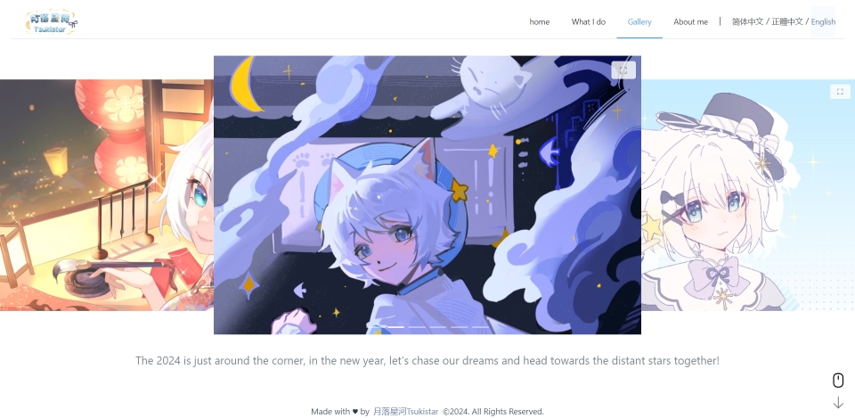

简体中文：

[English](./README.md) | [简体中文](./README.zh_CN.md) | [繁體中文](./README.zh_TW.md)

# 月落星河的国际化个人网站

月落星河的全新国际化个人网站采用 Vue 3 开发，并尝试了许多我以前从未尝试过的新功能，例如多语言支持、自定义Dialog、页面过渡动画、监听鼠标滚动与屏幕滑动事件切换路由、图片预加载等。

最近我正在进行网站的响应式优化，使其在移动设备和PC上都有绝佳的浏览体验。同时我正在引入Pinia进行一部分的状态管理，并对现有的代码进行优化。

## 作者

- [@月落星河Tsukistar](https://www.github.com/Tsukistar)

## 屏幕截图

## 技术栈

- Vue（Element-Plus、vue-i18n）
- Vite
- Pinia
- TypeScript

## 许可证

此项目采用 [MIT 许可证](https://choosealicense.com/licenses/mit/)。

## 支持

如需支持，请发送电子邮件至 tsukistar.bilibili@gmail.com 或访问我的 [Patreon](https://tsukistar.cc/patreon)。

## 附录

感谢 [readme.so](https://readme.so/) 帮助我编写 README.md。

感谢 [colorhunt.co](https://colorhunt.co/) 为我提供了一些配色方案。

感谢 [Yesicon](https://yesicon.app) 为我提供寻找图标的渠道。本网站使用的所有图标均来自 [Phosphor Icons](https://github.com/phosphor-icons/core) 和 [Prime Icons](https://github.com/primefaces/primeicons)，其许可证为 MIT。