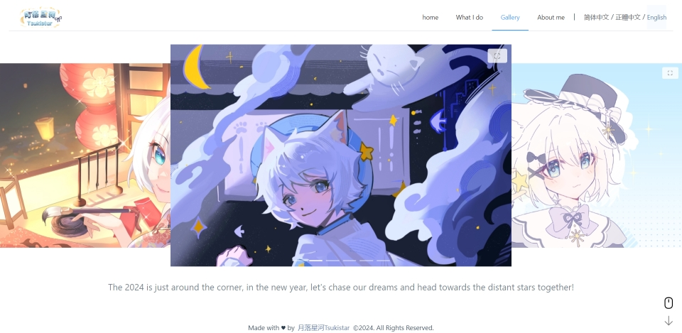

[English](./README.md) | [简体中文](./README.zh_CN.md) | [繁體中文](./README.zh_TW.md)

# 月落星河的國際化個人網站

月落星河的全新國際化個人網站採用 Vue 3 開發，並嘗試了許多我以前從未嘗試過的新功能，例如多語言支持、自定義對話框、頁面過渡動畫、監聽滑鼠滾動與屏幕滑動事件切換路由、圖片預加載等。

最近我正在進行網站的響應式優化，使其在移動設備和 PC 上都有絕佳的瀏覽體驗。同時我正在引入 Pinia 進行一部分的狀態管理，並對現有的程式碼進行優化。

## 作者

- [@月落星河Tsukistar](https://www.github.com/Tsukistar)

## 屏幕截圖

## 技術棧

- Vue（Element-Plus、vue-i18n）
- Vite
- Pinia
- TypeScript

## 許可證

此項目採用 [MIT 許可證](https://choosealicense.com/licenses/mit/)。

## 支持

如需支持，請發送電子郵件至 tsukistar.bilibili@gmail.com 或訪問我的 [Patreon](https://tsukistar.cc/patreon)。

## 附錄

感謝 [readme.so](https://readme.so/) 幫助我撰寫 README.md文件。

感謝 [colorhunt.co](https://colorhunt.co/) 給我提供一些配色方案。

感謝 [Yesicon](https://yesicon.app) 提供我尋找圖標的渠道。本網站所使用的所有圖標均來自 [Phosphor Icons](https://github.com/phosphor-icons/core) 和 [Prime Icons](https://github.com/primefaces/primeicons)，其許可證為 MIT。